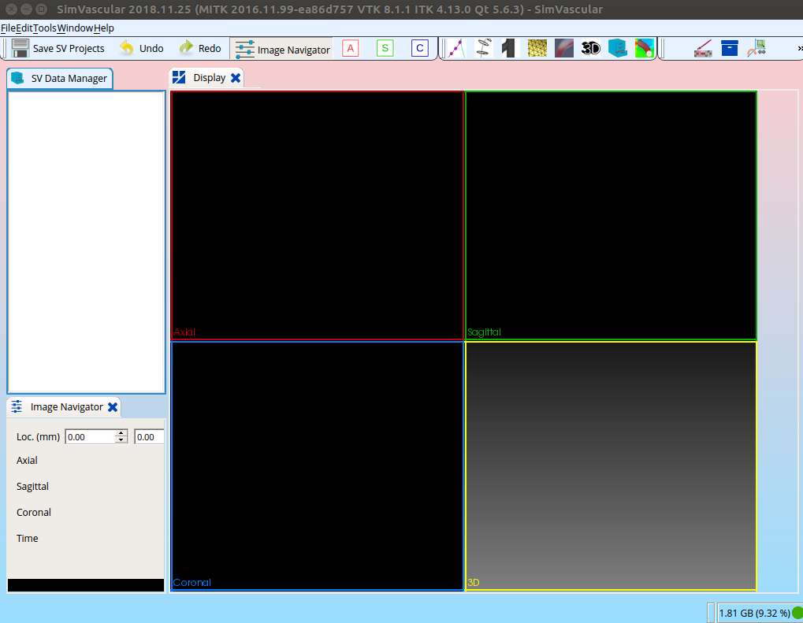

# SimVascular

This is a Docker build of SimVascular, intended to be run with Singularity.
The binary is not included here, but you can get it [from their site]().

The intended use case is the following:

# Usage

## Run via Singularity

The easiest thing to do is then run via Singularity. You can pull the container
first.

```bash
singularity pull --name simvascular docker://vanessa/simvascular
```

## Run the simvascular interface

By default, the container entrypoint is to the executable `simvascular` that will
open up the interface:

```bash
singularity run simvascular
```



If you want to use the solver, do this:

```bash
singularity exec simvascular svsolver

The process ID for myrank (0) is (23395).


The number of processes is 1.

Solver Input Files listed as below:
------------------------------------
 Local Config: solver.inp 
 Input file does not exist or is empty or perhaps you forgot mpirun?
```

or the svfsi solver (not sure about the difference) - note that you need mpi 1.10 on the
host for this to work. You probably don't have it (it's not on Sherlock). Sorry. See
[this issue](https://github.com/SimVascular/SimVascular/issues/368#issuecomment-443385120) 
to see why it's needed and there's nothing I can do about it.

```bash
singularity exec simvascular svfsi
```

Note that if you are on sherlock, you can always load additional libraries that you need,
a simple search with spider looks like this:

```bash
module spider mpi
```

# Development

## Build

If you re-obtain a new binary, you can build like this. Note that you will
need to update the [Dockerfile](Dockerfile) with the version you downloaded.

```bash
docker build -t vanessa/simvascular .
```

## Push

You can then tag and push to Dockerhub (this is how @vsoch does it) to
the repository [vanessa/simvascular](https://hub.docker.com/r/vanessa/simvascular/).

```bash
docker tag vanessa/simvascular:latest vanessa/simvascular:2018-11-25
docker push vanessa/simvascular
```

